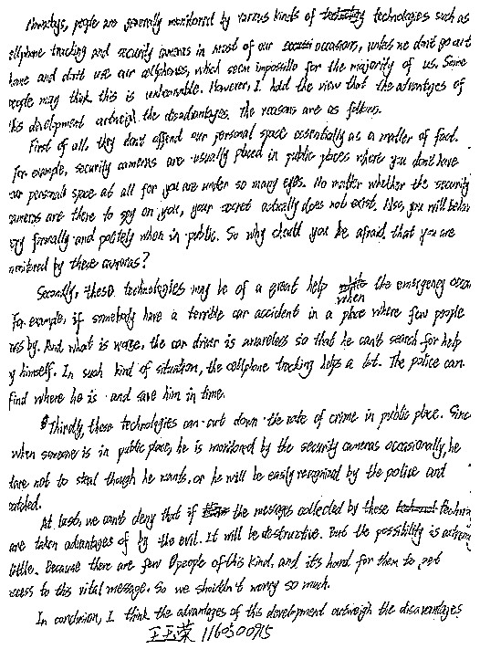
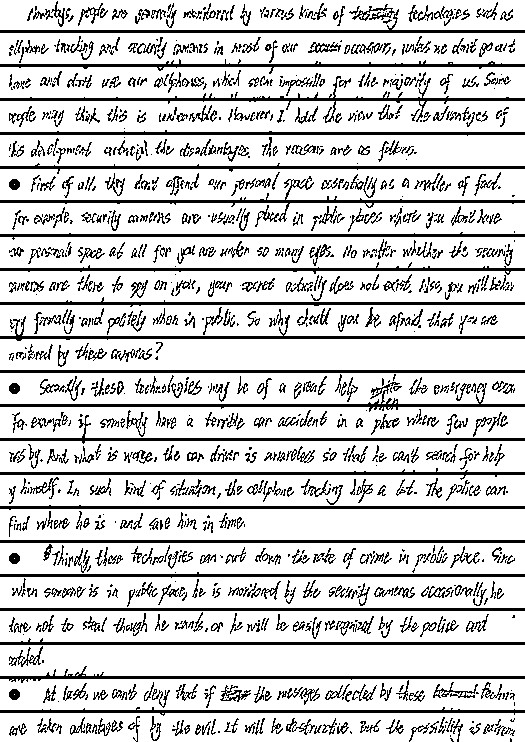

##输入输出
输入：一幅图像（比如手写的英语作文图像）
输出：许多图像list（代表输入图像中英语作文的每一行）
效果图如下：

##简要说明
这个项目主要是针对的是英文手写识别图像预处理的部分。做手写识别时，如果图像都像上面那样已经被切割好了那就会很容易，但往往最难的不是设计手写识别神经网络，而是前面的图像预处理部分，怎样把各种情况下的图像按行来切出来。这就是这个项目的初衷。
当然，不只是英文，手写中文作文也能切出来；如果不是手写的，而是打印的，那就更容易切。

##算法原理
主要分为两步，第一步求heatmap（文字区域热图）；第二步，根据heatmap规划切行。
核心思想：规则的堆积。
具体怎样的原理，看代码吧，很简单，反正就是各种规则。
其中第一步求heatmap，试验过使用深度学习unet网络，效果还是比较好的，只是速度较慢一点，最后还是没有采用深度学习的方法，因为本算法效果也很好，而且速度够快。
本代码主要使用Python写的，主要是因为为了配合其它项目的需要。当然，如果使用C++肯定速度会更快。其实刚开始我就是使用C++写的（包含c++代码），后来把它转成了Python代码。这个代码是很早写的，那时候刚学的Python，所以代码写的很挫且有很大c++风格（手动捂脸），但是请忽略，看效果就行了。
[img]

##更多实验结果

##有问题欢迎留言
在使用中有任何问题，欢迎反馈给我，也可以用以下联系方式跟我交流

* E-mail: 228812066@qq.com
* QQ: 228812066

